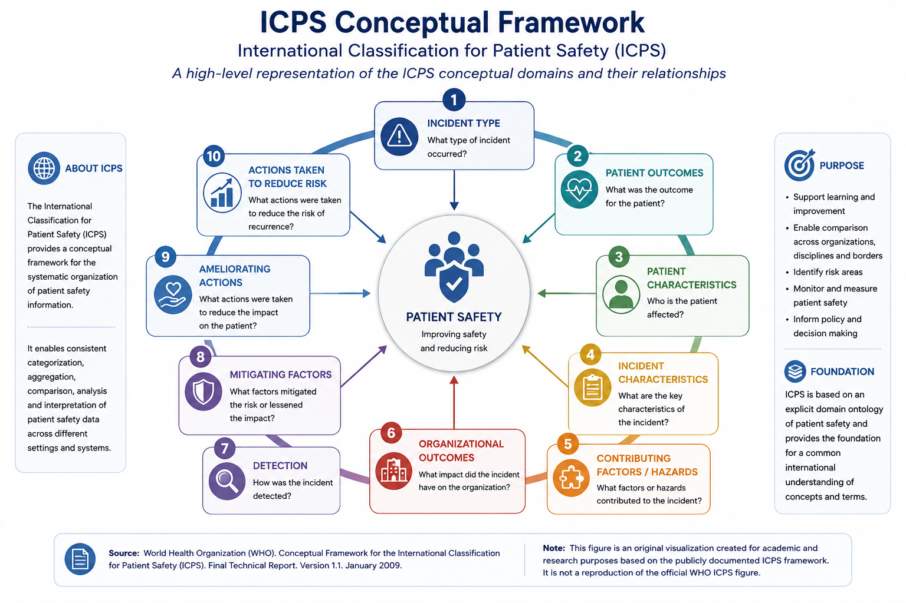

# Original High-Level Visualization of the WHO International Classification for Patient Safety (ICPS)

## Overview

The International Classification for Patient Safety (ICPS) was developed by the World Health Organization as a conceptual framework for organizing and understanding patient safety information.

The framework provides a structured conceptual landscape for describing patient safety incidents, patient outcomes, contributing factors, detection and mitigation processes, and actions related to patient safety improvement.

The conceptual domains represented in this visualization include:

- Incident Type;
- Patient Outcomes;
- Patient Characteristics;
- Incident Characteristics;
- Contributing Factors and Hazards;
- Organizational Outcomes;
- Detection;
- Mitigating Factors;
- Ameliorating Actions;
- Actions Taken to Reduce Risk.

## Relationship to the Onto_PPS Research

The ICPS represents one of the established patient safety knowledge frameworks considered within the broader landscape of patient safety classifications, taxonomies, and ontological approaches.

The Onto_PPS research was conducted within this broader scientific context of structured patient safety knowledge representation.

The use of established patient safety frameworks provided an important conceptual context for investigating how patient safety knowledge can be organized, represented, and evaluated within a domain-specific ontology.

This repository does not disclose the detailed implementation, mappings, hierarchy, or unpublished thesis-derived ontology development decisions of Onto_PPS.

## Figure Attribution and Scope

This figure is an original high-level visualization created for this research portfolio based on publicly documented conceptual domains of the World Health Organization International Classification for Patient Safety (ICPS).

It is not intended to reproduce the official WHO ICPS figure or the complete ICPS documentation.

The figure is presented for scholarly contextualization of the patient safety knowledge-representation landscape.

### Reference

World Health Organization. *Conceptual framework for the International Classification for Patient Safety*. Geneva: World Health Organization.

For the complete source and official documentation, please consult the original WHO publication.
