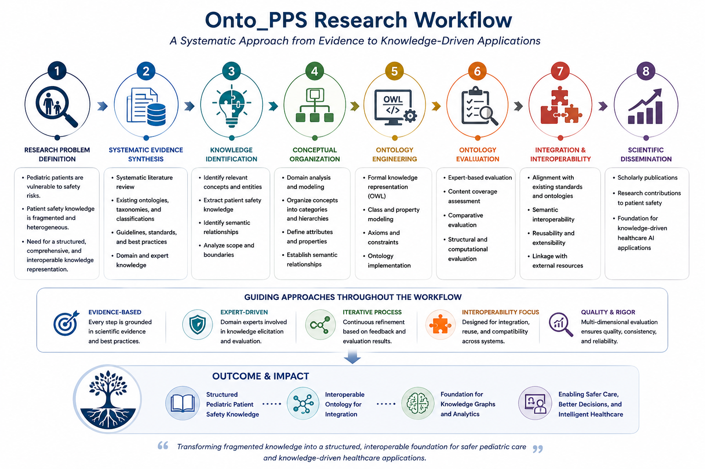

Onto_PPS

Pediatric Patient Safety Ontology Research Portfolio

A doctoral research programme at the intersection of Patient Safety, Medical Informatics, Ontology Engineering, and Knowledge-Driven Healthcare AI.

Research at a Glance

Dimension
Research Focus

Research Domain
Medical Informatics & Patient Safety

Clinical Context
Pediatric Patient Safety

Core Challenge
Fragmented and heterogeneous patient safety knowledge

Scientific Approach
Evidence Synthesis + Knowledge Organization + Ontology Engineering

Research Output
Onto_PPS

Evaluation Perspective
Multi-dimensional ontology evaluation

Research Legacy
Knowledge Representation → Knowledge Graphs → Trustworthy Healthcare AI

Overview

Onto_PPS represents the research portfolio of my doctoral research in Medical Informatics, focused on the development and evaluation of an ontology for pediatric patient safety.

The research addressed the challenge of representing complex, heterogeneous, and fragmented patient safety knowledge in a structured and formally organized manner.

The research programme integrated:

systematic evidence synthesis;

patient safety knowledge analysis;

conceptual knowledge organization;

ontology engineering;

formal knowledge representation;

semantic interoperability;

multi-dimensional ontology evaluation.

This repository presents the high-level scientific and methodological foundation of the research.

The Research Problem

Patient safety knowledge is distributed across diverse classifications, taxonomies, terminologies, conceptual frameworks, and information systems.

This fragmentation creates challenges for:

consistent knowledge organization;

semantic integration;

knowledge reuse;

interoperability;

computational reasoning;

future knowledge-driven healthcare applications.

The Onto_PPS research investigated how ontology engineering and formal knowledge representation could contribute to the structured organization of pediatric patient safety knowledge.

Research Workflow

The research followed an evidence-based and structured workflow:

Research Problem
      ↓
Systematic Evidence Synthesis
      ↓
Knowledge Identification
      ↓
Conceptual Organization
      ↓
Ontology Engineering
      ↓
Knowledge Representation
      ↓
Multi-Dimensional Evaluation
      ↓
Scientific Dissemination

The research connected methodological approaches from:

Patient Safety → Medical Informatics → Knowledge Representation → Ontology Engineering

The Onto_PPS research was situated within the broader landscape of patient safety classifications, taxonomies, and knowledge-representation frameworks, including the WHO International Classification for Patient Safety (ICPS).
## Patient Safety Knowledge Representation Context

The Onto_PPS research was situated within a broader landscape of established patient safety classifications, taxonomies, and knowledge-representation frameworks.

The World Health Organization International Classification for Patient Safety (ICPS) represents one important conceptual framework within this landscape.

The icps figure presents an original high-level visualization of publicly documented ICPS conceptual domains. It is provided for research context and does not reproduce the Onto_PPS ontology or its unpublished implementation details.

For a detailed explanation of the figure and its relationship to the research context, see [`Figures/icps-conceptual-framework.md`](figures/icps-conceptual-framework.md).

Conceptual Research Framework

WHO International Classification
for Patient Safety (ICPS)
              │
              │  Broader Patient-Safety
              │  Knowledge Landscape
              ▼
Onto_PPS Doctoral Research
              │
              ▼
Pediatric Patient Safety Knowledge
              │
              ▼
Evidence-Based Knowledge Identification
              │
              ▼
Conceptual Organization
              │
              ▼
Ontology Engineering
              │
              ▼
Structured Medical Knowledge
              │
              ▼
Semantic Knowledge Integration
              │
              ▼
Knowledge Representation
              │
              ▼
Knowledge-Driven Healthcare Applications

The framework reflects a central research principle:

Complex healthcare knowledge can be transformed into structured, formally represented knowledge to support integration, interpretation, and future computational applications.

Onto_PPS Research Contribution

The doctoral research contributed to the development of a structured knowledge representation approach for pediatric patient safety.

Its broader scientific contributions included:

investigating methodologies for patient safety ontology development;

examining approaches to ontology evaluation;

organizing heterogeneous pediatric patient safety knowledge;

addressing challenges related to knowledge fragmentation;

exploring the role of formal knowledge representation in Medical Informatics;

establishing a foundation for future semantic and knowledge-driven healthcare applications.

Evaluation Perspective

The research incorporated a multi-dimensional perspective on ontology evaluation.

The evaluation framework considered dimensions including:

content coverage;

conceptual representation;

knowledge organization;

comparative assessment;

expert-oriented evaluation;

structural and computational perspectives.

The evaluation approach was designed to examine the quality and usefulness of a domain-specific knowledge representation from multiple complementary perspectives.

Interoperability Perspective

A central motivation of the research was the potential of structured knowledge representation to support semantic interoperability.

Heterogeneous Knowledge Sources
              ↓
Conceptual Harmonization
              ↓
Formal Knowledge Representation
              ↓
Semantic Alignment
              ↓
Knowledge Integration

From this perspective, ontology engineering provides a conceptual foundation for connecting heterogeneous healthcare knowledge and supporting more consistent interpretation across systems.

Research Significance

The significance of the research extends beyond the development of a domain-specific ontology.

The research demonstrated how:

Evidence-Based Research
          +
Structured Medical Knowledge
          +
Ontology Engineering
          +
Knowledge Integration
          +
Formal Representation
          ↓
Foundation for Knowledge-Driven Healthcare AI

This research trajectory connects patient safety research with broader developments in:

knowledge graphs;

ontology-driven clinical intelligence;

clinical decision support;

explainable artificial intelligence;

trustworthy healthcare AI.

Research Trajectory

The broader research trajectory can be conceptualized as:

Patient Safety Research
          ↓
Knowledge Representation
          ↓
Ontology Engineering
          ↓
Knowledge Integration
          ↓
Knowledge Graphs
          ↓
Ontology-Driven Clinical AI
          ↓
Explainable and Trustworthy Healthcare AI

The Onto_PPS research represents an early foundation of this continuing research direction.

From Doctoral Research to Current Research

The conceptual and methodological foundation developed through the Onto_PPS research continues to inform research interests in:

biomedical knowledge graphs;

ontology-driven clinical decision support;

clinical natural language processing;

explainable AI;

knowledge-enhanced machine learning;

trustworthy and responsible healthcare AI.

The continuing research principle is:

Healthcare AI should be supported by structured, domain-relevant, interpretable, and scientifically grounded knowledge.

Scholarly Outputs

The research programme contributed to scholarly work concerning:

patient safety classifications;

taxonomies and ontologies;

ontology development methodologies;

ontology evaluation methodologies;

patient safety knowledge coverage;

patient safety knowledge representation for healthcare information technology and medical devices.

See references/publications.md for the associated scholarly outputs.

Research Portfolio Scope

This repository is intentionally designed as a research portfolio and scientific project showcase.

It documents:

research objectives;

research background;

methodology;

research workflow;

conceptual frameworks;

evaluation perspectives;

interoperability considerations;

scientific significance;

research legacy;

scholarly outputs.

What This Repository Does Not Contain

To respect applicable institutional policies and intellectual property considerations, this repository does not publicly distribute:

the complete Onto_PPS ontology artifact;

the full doctoral dissertation;

the complete ontology class hierarchy;

the complete semantic relationship structure;

unpublished thesis-derived datasets;

unpublished evaluation datasets;

confidential research materials.

The repository therefore presents the research programme and its scientific foundation, rather than the unpublished ontology artifact itself.

Research Legacy

The Onto_PPS research represents a foundational stage in a continuing research trajectory:

Pediatric Patient Safety
          ↓
Medical Knowledge
          ↓
Ontology Engineering
          ↓
Knowledge Graphs
          ↓
Clinical AI
          ↓
Trustworthy Healthcare AI

The research legacy lies in the continuity between:

Domain Knowledge → Formal Representation → Knowledge Integration → Intelligent Healthcare Systems

Repository Structure

Onto_PPS/
│
├── README.md
├── CITATION.cff
├── .gitignore
│
├── docs/
│   ├── research-background.md
│   ├── research-objectives.md
│   ├── methodology.md
│   ├── research-workflow.md
│   ├── healthcare-ai-foundation.md
│   ├── evaluation-framework.md
│   ├── research-significance.md
│   └── research-legacy.md
│
├── diagrams/
│   ├── research-workflow.md
│   ├── conceptual-framework.md
│   ├── research-trajectory.md
│   └── research-legacy.md
│
└── references/
    ├── publications.md
    └── doctoral-dissertation.md

Scientific Identity

Onto_PPS is more than an ontology project.

It represents a research journey from:

Understanding a complex patient safety domain

to:

Organizing medical knowledge

to:

Engineering formal knowledge representations

to:

Building foundations for knowledge-driven healthcare AI.

Author

Sharare Taheri Moghadam, PhD in Medical Informatics

Research interests:

Medical Informatics;

Patient Safety;

Ontology Engineering;

Knowledge Representation;

Biomedical Knowledge Graphs;

Clinical AI;

Explainable AI;

Trustworthy Healthcare AI.

Disclaimer

This repository is provided for academic portfolio and research documentation purposes.

The materials presented here describe the high-level scientific and methodological aspects of the Onto_PPS research. The complete doctoral dissertation, ontology artifact, and other unpublished thesis-derived research materials are not publicly distributed through this repository.

For scholarly use of the associated research, please refer to the cited publications and institutional sources.

Citation

If you refer to the research described in this repository, please cite the associated scholarly publications listed in:

references/publications.md
